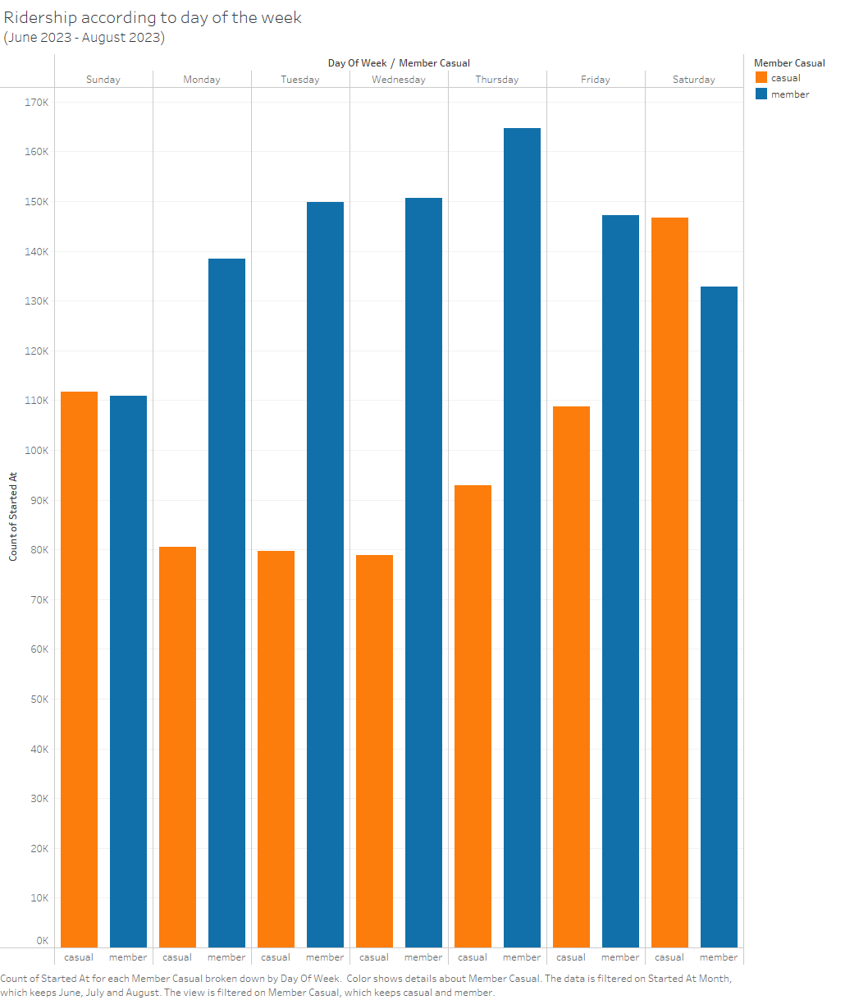

# Google-Capstone-Project

#### Made by Nicholas Soh

### Introduction 

This is my Capstone Project for the Google Data Analytics Course on Coursera. This project comprises of a case study on a fictional bike-sharing company, Cyclistic.

Cyclistic is a fictional bike-sharing serivce provider with over 5,800 bikes that are geotracked and almost 700 stations across Chicago. The bikes can be unlocked and docked from one station and returned to any other station in Chicago. 

Since its incorporation to date, Cyclistic has relied on building general awareness and appealing to the broad customer segments. One approach that helped make these possible was the flexibility of its pricing plans: single-ride passes, full-day passes, and annual memberships. Customers who purchase single-ride or full-day passes are referred to as __casual__ riders/users. Customers who purchase annual memberships are Cyclistic __members__. Its finance analysts has concluded that annual memberships are much more profitable than casual riders. Maximizing the number of annual members is the key to future growth of Cyclistic. 

The director of marketing has set the goal to design marketing strategies aimed at converting casual riders into annual members. This project will delve deeper to understand how annual members and casual riders differ, why casual riders would buy membership, and how digital media could affect their marketing tactics. Hence, historical bike trip data will be analyzed to identify these behavioral trends and identify a strategy.

---

### Data used

The data is comprised of 12 months of bike trip data between May 2023 and April 2023. No personal or customer data was shared. Motivate International Inc. provides the data with the following license (https://www.divvybikes.com/data-license-agreement). In compiling the data from the 12 months, there were 5,738,612 trips that were recorded and to be analyzed. The source of the data is found on (https://divvy-tripdata.s3.amazonaws.com/index.html)

The following are the filenames that were used for this project:

* 202305-divvy-tripdata.zip (May 2023)
* 202306-divvy-tripdata.zip (June 2023)
* 202307-divvy-tripdata.zip (July 2023)
* 202308-divvy-tripdata.zip (August 2023)
* 202309-divvy-tripdata.zip (September 2023)
* 202310-divvy-tripdata.zip (October 2023)
* 202311-divvy-tripdata.zip (November 2023)
* 202312-divvy-tripdata.zip (December 2023)
* 202401-divvy-tripdata.zip (January 2024)
* 202402-divvy-tripdata.zip (February 2024)
* 202403-divvy-tripdata.zip (March 2024)
* 202404-divvy-tripdata.zip (April 2024)

### Data preparation

I used __Visual Studio Code__ editor to extract and load the csv files into a folder and used __SQLite3__ to compile a database for data cleaning and transformation. Once the data cleaning was conducted, the views were created to extract data and exported into csv files to be imported into __Tableau__ for visualization. 

* The full schema file used for the creation of the database and data cleaning can be found in the [schema.sql](database/schema.sql) file.  
* The Tableau working file used for the visualizations can be found in the [visualization](##TODO) file. 
* The data visualizations can be found in the [visualizations](visualizations) folder. 

To dissect the contrast between members and casual riders, there are several preliminary questions I had into identifying if there were differences between the:

1. __Seasonality of bike ridership__: between members vs casual users? | Duration between seasons, breakdown to weekdays and weekends.
2. __Preference of product offering__: There are 3 different types of bikes (Electric, Classic, Docked) do members/casuals prefer one over others?
3. __Locationality of bike pickups__: Are there locations that are more used than others? Could there be a limited availability of bikes in hotspots? Is there a difference between residential areas vs commercial areas?

### Limitations around data used

Based on the questions I had, I found that there are several limitations with the data available for the analysis.

1. No demographic data on members or casuals to determine if there are any demographical impact to the bike usage
2. No information on pricing of usage between bike types or membership prices
3. Full data on all the stations were not available, only stations that are part of the data are considered and if there are any stations that were not interacted with over the 12 month period, it will not be considered in this report. 

## Data cleaning

1. There are 1,402,657 records where the station names of the start and/or end points are missing. These trips will be assumed to be invalid and will be removed. (4,335,955 records remain)

    `DELETE FROM rides WHERE start_station_name = '' OR end_station_name = '';`

2. There are 652 records where the timestamp of the trip start time is either after or the same as the trip end time. These instances are assumed to be either returned immediately or erroneous records and will be removed. (4,335,303 records remain)

    `DELETE FROM rides WHERE ended_at <= started_at;`

3. There are 15 records where the station names/id seem to be test records, e.g. "OH Charging Stx - Test", "OH - BONDFIRE - TESTING". These records seem to be test rides by the company and are removed. (4,335,288 records remain)

    `DELETE FROM rides WHERE start_station_name LIKE '%test%' OR end_station_name LIKE '%test%';`

4. There was a record where the ending station longtitude and langtitude coordinates were posted as 0, which would not be possible as the distance would be out of US. It is very likely that this record was an error and hence was removed. 

    `DELETE FROM rides WHERE end_lat =0 OR end_lng = 0;`

## Findings

1. __Seasonality of bike ridership__

    In analyzing the seasonality of bike ridership, Figure 1.1 shows the frequency of ridership according to the months depicts a strong indication that bike ridership is at its highest in August and at its lowest in the month of January due to the change in climate.

    

    Digging deeper, we will analyze the difference between members and casual users. In Figure 1.2 below, it details 2 main points:
    
    1. Ridership is highest in the warmer months and lowest in the cooler months across members and casual users of Cyclistic bikes.
    2. Most of the users of Cyclistic bikes are members across the year.

    

    We can delve deeper into the data to identify if there are any behavioural differences between ridership between the member and casual users by dissecting the frequency of ridership according to the day of the week. In Figure 1.3, we explore the ridership according to the day of the week between members and casual riders in the months of June to August 2023, where ridership is at its highest in the 12 month period. 

    

    Pertinently, we can identify that there is a divergence in the behavior of members and casual users according to the day of the week in the peak months. 
    
    Notably, we can see that ridership amongst members is highest during the weekdays. Whereas, ridership amongst casual users is highest during the weekends, even surpassing member ridership during the weekends. It is possible that this divergence is due to members, predominately, using the bikes for their daily commute to and from work/school and casual users are more likely to use the bikes on weekends for leisure, running errands or used by tourists.

    Figure 1.4 explores the ridership according to the day of the week between members and casual riders during the cooler months, where ridership is at its lowest during the 12 month period. 

    

    It is notable that although ridership across all days are a lot lower than the warmer months, ridership is dominated by member users and members are making more trips during the weekdays. This further indicates that Cyclistic members frequently use the bikes for their daily commute for work/school during the weekdays and lesser on the weekends. It is also notable that trips made by casual users during this 3 month period remains low across the week, showing that during the colder months, non-members are not as willing to use the bikes and prefer other means of transport. 

    We will focus on the peak months as this is most indicative of ridership during the year and if Cyclistic is able to increase its conversion rate from casual riders to member, it will bring the optimum results from their marketing efforts. In Figure 1.5, we can see the ridership according to the hours of the day between members and casual rides during the months of June to August 2023. 
    
    

    For members, we can see a hike in ridership during the hours of 7 to 9 am and 5 to 7 pm which is indicative of members using the bikes for their commute from work. We see a smaller but similar sentiment in casual riders during these two periods as well, indicating that a fair proportion of casual riders are also using the bikes for their commute as well. 

2. __Prefrence of product offering__ 

    There are 3 different types of bikes that are offered by Cyclistic:
        1. Electric bike
        2. Docked bike
        3. Classic bike

    In Figure 2.1, it shows the breakdown of the usage of bike types between members and casual users.

    

    We are able to see that the classic bike is vastly favoured by members and casual users and the preference for the electric bike picked after. The docked bike is only used by a smaller fraction of casual users and not at all by members of Cyclistic. 

    Excluding the docked bike, we can see that the general preference of the classic bike and electric bike is quite similar across members and casual users. A possibility could be the perceived price value of each of the products and as the ratio is quite similar between both market segments, we can deduce that the pricing of each of the strategy is balanced between members and casuals, which may drive a sentiment in non-members that there is not enough value in cost savings in opting for a membership.  

3. __Locationality of bike pickups__

    .png)

    From Figure 3.1 above, it is noted the locations which are used by both members and casual users are both heavily saturated in the city centre. However, we can see that the pickup locations of casual riders cover a wider area in the outskirts of the Chicago city centre than members. The heavy concentration of pickups in the city centre could be an area of concern as it may ellude to insufficient availability of bikes for potential users giving rise to the perception that bikes may not be available even with a membership. 

---

### Summary

The main findings are summarized as the following:

* Bikes are most used during the warmer months and non-members use the bikes a lot lesser during the cooler months.  
* Members and casual rides diverge in their use during the week. Members primarliy use bikes to commute to work on weekdays and casual riders mostly use the bikes on weekends. 
* Riders are indifferent in choice of bikes whether they have a membership or not. 

---

### Recommendations

The results from the findings shows that there is a divergence in the use cases of Cyclistic bikes in members and casual riders. Where casual rides, generally, use the bikes during weekends while members use the bikes on the weekdays for their commutes. For the marketing campaign to be effective in increasing the conversion of casual rides to members, it needs to targetted at specific market segments. 

Based on the data, the following are my recommendations:

* Increasing marketing efforts during the spring and summer months will be most impactful.
* Emphasising advertising and promotional material to casual users who use the bikes for their daily commute would be the key market segment that is most likely of conversion as this closely aligns with the behaviour of its current members. 
* Enhance the app capability to either allow members to reserve bikes or view nearby bikes easily to incentize casual users to opt for membership

...